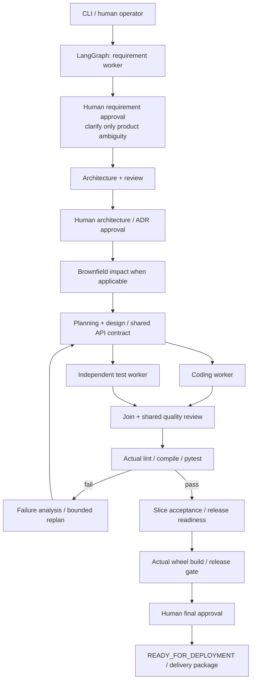

# Governed agentic SSDLC

The default evaluation path is deterministic and offline so the workflow is reproducible. A DeepSeek provider is included as an optional real-LLM extension.

Specialized deterministic workers generate a **working URL shortener**, independent tests and engineering documents. LangGraph provides real stateful routing, parallel execution, synchronization, human interrupts, retries and recovery. Actual tests and builds determine success. Mock workers use bounded templates; they are **not LLM-powered**.

The implementation follows [SupplementaryPrompt.txt](SupplementaryPrompt.txt), preserving the existing graph and persistence. Final approval records `READY_FOR_DEPLOYMENT`; it does not deploy the service.

## What this demonstrates

| Key feature | Demonstration |
|---|---|
| Three human gates | Requirement review/clarification, architecture and ADR approval, final release approval. |
| Independent parallel workers | Code and tests receive the same approved design; tests receive no generated implementation. One shared quality review follows their join. |
| Real validation | Ruff, compilation, pytest with mapped acceptance IDs, and wheel build execute against generated files. |
| Controlled recovery | Failed tools trigger deterministic diagnosis and targeted, bounded replanning; exhausted budgets produce a safe stop. |
| Stateful evidence | SQLite checkpoints support pause/resume. Versioned filesystem artifacts retain lineage; SQLite indexes state, audit and metrics. |
| Three offline scenarios | Greenfield URL shortener, ambiguous expiration clarification, brownfield daily analytics from generated source. |
| Readable delivery | Approved source/tests, wheel, numbered documents, JUnit evidence, audit and manifest export to a folder and ZIP. |

## Architecture



Workers propose artifacts; graph policy owns transitions and approvals. Code/tests share interface declarations, then synchronize before review. Recovery can return to affected code, tests or design; the diagram groups these routes. [Architecture](docs/architecture.md) explains storage and ownership; [orchestration](docs/orchestration.md) lists recovery rules and bounds.

## 1. Install

Use Python 3.11+ from the repository root. Initial dependency installation needs package access; subsequent default demos need no network, key, `.env` or local model.

```powershell
python -m venv .venv
.venv\Scripts\python -m pip install -r requirements-dev.lock
.venv\Scripts\python -m pip install -e . --no-build-isolation --no-deps
.venv\Scripts\python -m ssdlc --help
```

Calling the interpreter explicitly avoids PowerShell activation issues. On Linux/macOS use `.venv/bin/python`. CI installs pinned dependencies and never calls DeepSeek.

## 2. Run the three offline scenarios

These commands use **MOCK / DETERMINISTIC MODE** and prompt for human review. Known deterministic demos enable local execution for actual validation/build. Greenfield has zero clarification questions: review and approve requirements, architecture/ADRs and final release.

```powershell
.venv\Scripts\python -m ssdlc demo greenfield
.venv\Scripts\python -m ssdlc demo ambiguous
.venv\Scripts\python -m ssdlc demo brownfield
```

Complete greenfield before brownfield. Brownfield automatically snapshots its approved package's `application/` directory and adds UTC daily click analytics through the same graph. Existing routes and total counts remain; earlier clicks have no historical daily attribution.

Ambiguous uses exactly `Add expiration support.` and asks four product questions: optional/mandatory, default TTL, expired response and retention. Select `clarify`, answer, then separately approve the new version. Supported choices are optional/mandatory, no default/3600 seconds, 410/404 and retain/delete on access. Existing links remain permanent. There are no table-schema, framework or scheduler questions.

At requirement review, `revise` requests a new draft in your rationale without answering the old questionnaire. Architecture choices and consistent defaults are reviewed with the artifact. Only `PRODUCT_AMBIGUITY` can require clarification; `ARCHITECTURE_DECISION` and `NON_BLOCKING_ASSUMPTION` do not block requirements.

For an evaluator smoke run with explicitly labeled **synthetic** decisions:

```powershell
.venv\Scripts\python -m ssdlc --home .ssdlc/evaluation demo greenfield --scripted
.venv\Scripts\python -m ssdlc --home .ssdlc/evaluation demo ambiguous --scripted
.venv\Scripts\python -m ssdlc --home .ssdlc/evaluation demo brownfield --scripted
```

Scripted decisions are only for mock demonstrations/tests, not real product approval. The expiration smoke run selects optional expiration, no default TTL, HTTP 410 and retained records. Without `--scripted`, humans make each decision. Successful demos automatically create the approved delivery folder and ZIP.

Default run IDs are `demo-greenfield`, `demo-ambiguous` and `demo-brownfield`. Existing runs are never overwritten. Repeat with a new `--home`, or fresh `--run` IDs and brownfield `--from-run <prior-greenfield-id>`. `--source <application-directory>` accepts an explicit generated source directory.

## 3. Run the generated application

The [small baseline](examples/url-shortener/requirement-demo.txt) has six functional requirements, four nonfunctional requirements and eleven acceptance criteria. It uses Python HTTPServer, SQLite and synchronous counts.

| Route | Behavior |
|---|---|
| `POST /links` | JSON `{"url":"https://example.org"}` creates a fresh code; 201 with code/short path. |
| `GET /r/{code}` | 302 with exact target and `no-store`; increment count transactionally. Unknown codes: 404. |
| `GET /links/{code}/analytics` | Code/count or 404; brownfield adds a UTC `daily` map. |
| `GET /health` | 200 liveness independent of database availability. |

```powershell
cd .ssdlc/deliverables/demo-greenfield/release-v1/application
python -m url_shortener --database links.sqlite --port 8000
```

In another PowerShell terminal:

```powershell
Invoke-RestMethod -Method Post -Uri http://127.0.0.1:8000/links -ContentType application/json -Body '{"url":"https://example.org"}'
curl.exe -i http://127.0.0.1:8000/r/1
Invoke-RestMethod http://127.0.0.1:8000/links/1/analytics
Invoke-RestMethod http://127.0.0.1:8000/health
```

Replace `1` with the returned code if the database already has links. Redirect tests do not follow/fetch targets. Stop with Ctrl+C. Alternatively install the generated wheel and run `url-shortener`.

## 4. Inspect, resume and package

From the repository root:

```powershell
.venv\Scripts\python -m ssdlc inspect demo-greenfield
.venv\Scripts\python -m ssdlc audit demo-greenfield
.venv\Scripts\python -m ssdlc metrics demo-greenfield
.venv\Scripts\python -m ssdlc --allow-local-execution resume demo-greenfield --interactive
```

Use the original `--home`; global flags precede the subcommand. Restart an open CLI after source updates. Generic/live execution requires `--allow-local-execution`. At safe stops inspect evidence first; `retry` renews a bounded budget and never skips tests. Requirement revisions retain history and need new approval.

Validation temporary files live inside the run workspace, outside its candidate, so pytest does not depend on shared Windows temp-folder permissions. A safe stop includes the failed tool command and output; fix that reported cause before retrying.

Default delivery:

```text
.ssdlc/deliverables/demo-greenfield/
  demo-greenfield-release-v1.zip
  release-v1/
    README.md
    application/            source, tests, app README and build metadata
    distribution/           built wheel
    documents/              numbered requirements, architecture, ADRs,
                            plan/design, readiness and validation documents
    artifacts/              final versioned JSON with readable names
    evidence/               JUnit, tools, approvals, audit and full history
    manifest.json           references and exported-file SHA-256 hashes
```

For an approved generic run use `python -m ssdlc package <run>`. Packaging refuses pending approval, stale/tampered evidence and existing destinations. Use the final package for human navigation; internal artifacts remain versioned.

For an interviewer handoff beside this repository, export the approved run to a sibling folder:

```powershell
.venv\Scripts\python -m ssdlc package demo-greenfield --output ..\url-shortener
```

This creates `url-shortener/` beside `schwab-assignment/`, plus a sibling ZIP. Open its top-level README, then `application/README.md` for running the app; `documents/` and `evidence/` retain approved artifacts and actual validation. The destination must be new. The original run remains available for audit and resume.

## 5. Real validation and build evidence

```powershell
.venv\Scripts\python -m ruff check src tests
.venv\Scripts\python -m ruff format --check src tests
.venv\Scripts\python -m pytest -q
.venv\Scripts\python -m build --wheel --no-isolation
```

The suite exercises all three offline CLI scenarios, generated HTTP/persistence tests, actual wheel/package checks, independent branches, clarification/approval, targeted recovery, invalidation and safe stops. [Testing and evidence](docs/testing.md) separates deterministic results from historical live-model attempts.

## 6. Optional real-LLM mode

DeepSeek remains behind the same Provider boundary as **OPTIONAL REAL-LLM MODE**. Submission/evaluation does not require it. Select it explicitly with `--provider deepseek`; an existing real-key `.env` cannot switch a default offline demo.

Copy `.env.example` to `.env`, set the key privately, then:

```powershell
.venv\Scripts\python -m ssdlc --provider deepseek --allow-local-execution start --requirement examples/url-shortener/requirement-demo.txt --run optional-live-1 --interactive
```

Existing model/base URL/timeout settings still apply. `.env` is ignored by Git. Real outputs can fail bounded validation or need clarification; no synthetic fallback or scripted real-LLM approval exists. The [28-criterion specification](examples/url-shortener/requirement-complete.txt) and saved analyses are historical/advanced examples, not the default exercise.

## Tradeoffs and pending enhancements

Bounded templates support documented inputs and prior generated brownfield source, not arbitrary repositories. The greeting fixture remains for platform regression tests. Baseline excludes TTL, auth, deletion, aliases and rate limiting; expiration is separate. HTTPServer is a local prototype server. No exhaustive DNS validation, async workers, distributed runtime, UI or cloud deployment is included.

Tools/build hooks execute on the host; path/environment checks are not process isolation. Approver names and audit hashes are local assertions, not authenticated identity or externally immutable audit. Readiness means declared gates passed, not production certification.

[Enhancements](docs/enhancements.md) lists deferred work; [decisions](docs/decisions.md) explains tradeoffs. The submission emphasizes reliable controlled autonomy, with replaceable agent behavior behind a deterministic control plane.
