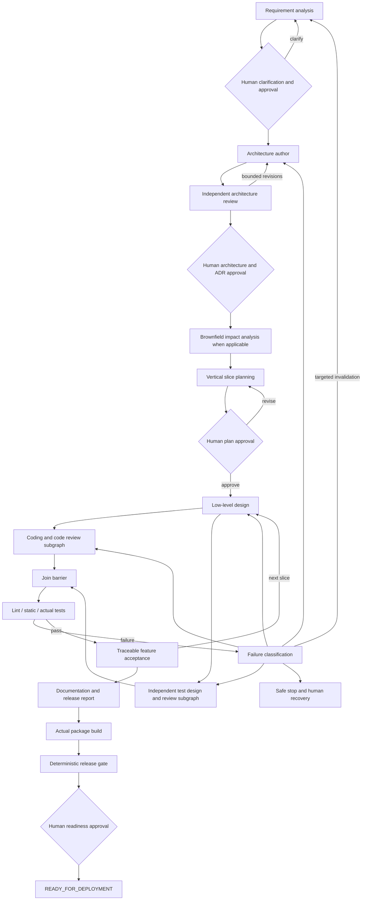

# Governed Agentic SSDLC

**Reasoning is probabilistic; control is deterministic.**

A runnable Python/LangGraph prototype that turns requirements into versioned,
reviewed engineering artifacts, executes deterministic validation, and pauses for
human decisions. Built as a reusable platform before any URL-shortener workload.

The default development integration is **local Ollama**, configured through `.env`.
No paid model or API key is required. The `demo` command uses an explicitly labeled
**offline synthetic fixture** implementing only a greeting library. Its graph,
approvals, persistence, tests and wheel build are real. Product generation uses the
configured model and actual human decisions. No production deployment is included.

## Quick start

Python 3.11+ (verified locally with Python 3.14). From PowerShell:

```powershell
python -m venv .venv
.\.venv\Scripts\python -m pip install -e ".[dev]"
.\.venv\Scripts\python -m pytest -q
.\.venv\Scripts\python -m ssdlc --allow-local-execution demo --scripted
.\.venv\Scripts\python -m ssdlc metrics minimal-demo
.\.venv\Scripts\python -m ssdlc export minimal-demo --output examples/minimal/execution.json
```

On macOS/Linux use `.venv/bin/python`. Omit `--scripted` for a real interactive
approval workflow. Scripted approvals are labeled `synthetic-demo-human` and
exist only in the fixture demo. Use a new `--run` identifier to repeat a demo.

`--allow-local-execution` explicitly enables host subprocesses. Workspace path
checks, argument arrays, timeout, restricted environment and trusted command
profiles are implemented. **These are not an OS sandbox.** Run model-generated
code in a disposable isolated environment without credentials or network access.
The command defaults to execution disabled.

## Workflow



The implementation uses LangGraph conditional edges, bounded review subgraphs,
parallel branches, a join barrier, SQLite checkpoints, `interrupt()` and
`Command(resume=...)`. Governance remains application-owned. See
[framework decision](docs/langgraph-decision.md) and [architecture](docs/architecture.md).

## CLI decisions

For a conversational terminal workflow, use `--interactive`. It displays each
human gate, collects approval, clarification or revision input, and continues
through subsequent gates without decision JSON files. A spinner indicates active
LLM requests; retries and provider switches are reported in the terminal. Use
`resume --interactive` to return to a checkpoint later. The existing `--decision`
JSON mode remains available for automation.

```powershell
.\.venv\Scripts\python -m ssdlc start --interactive --run my-run --requirement examples/minimal/requirement.txt
.\.venv\Scripts\python -m ssdlc resume my-run --interactive
```

To run without prompts, use the decision-file examples below.

These examples select the fixture explicitly. For actual local-model work, omit
`--provider mock` and follow [configuration](docs/configuration.md).

```powershell
.\.venv\Scripts\python -m ssdlc --provider mock start --run my-run --requirement examples/minimal/requirement.txt
.\.venv\Scripts\python -m ssdlc inspect my-run
.\.venv\Scripts\python -m ssdlc --provider mock resume my-run --decision examples/minimal/clarify.json
.\.venv\Scripts\python -m ssdlc --provider mock resume my-run --decision examples/minimal/approve-requirement.json
```

After requirement approval, inspect and approve the architecture/ADRs, then review
the generated plan at its own human gate before LLD, coding, or test design starts.
Copy the current `artifact_ref` into each explicit decision file before resuming.
Approving requirements with unanswered blocking questions is rejected **before**
consuming the interrupt. Clarification creates a new requirement version that
must be approved separately. Approval is always bound to an exact version.

To continue into execution, supply `--allow-local-execution` before `resume`.
Final approval marks readiness; it does not deploy.

If a running interactive CLI reaches `safe_stop` after a code fix, press `Ctrl+C`
and restart it with `resume <run> --interactive` so Python loads the updated code.
Choose `retry` at the recovered gate to renew its bounded budget. Existing
requirement approvals and artifact history remain available.

Architecture responses are checked for complete, nonempty sections, exact
requirement mappings, and valid ADR IDs inside the provider retry loop. Missing
sections are named in repair feedback. An incomplete cached response is rejected
and replaced only after a valid repair; its original file remains as evidence.

LLD responses follow the same repair boundary: slice, acceptance-criterion,
requirement and ADR references must match the approved plan exactly. Descriptions
and design notes belong in document sections rather than reference lists. Safe-stop
prompts omit resolved or accepted findings, and those findings cannot be accepted
again to bypass an unrelated design failure.

## Agents and controls

Role-specific structured contracts cover requirement analysis, architecture,
architecture review, planning, LLD, coding, code review, test design, test review,
failure analysis, brownfield impact, documentation and release readiness.

* Author and reviewer invocations have separate contexts; no shared chat transcript.
* Both parallel branches consume the same requirement/architecture/ADR/LLD versions.
* Test design receives no generated implementation.
* Provider output cannot set approval state, tool results, routing or budgets.
* Default budgets: three review cycles, three re-plans, two provider attempts.
* HIGH risk acceptance requires a human decision; BLOCKER cannot be waived.
* Artifact updates invalidate only dependency descendants; unrelated artifacts survive.
* Local SQLite stores checkpoints, artifact/cache indexes and hash-chained audit events.
* Versioned artifact bodies, readable documents, source files and provider responses live under `.ssdlc/runs/<run>/`.

## Providers and language independence

`Provider.generate(role, instructions, context, schema)` is the integration boundary.
The native `OllamaProvider` uses the local JSON-schema chat API. Environment settings
select models and optional explicit fallback. See [provider architecture](docs/llm-provider-architecture.md)
and [configuration](docs/configuration.md) for setup and failure handling.

`StructuredChatProvider` adapts a configured LangChain-compatible model supporting
`with_structured_output`. A trusted `module:factory` can supply any implementation:

```powershell
python -m ssdlc --provider my_provider:create start --requirement requirement.txt
```

Factories read credentials from the environment. Do not embed credentials in
requirements, artifacts or command arguments. Model services are not provisioned
or called by the default demo. Provider identity must match on resume.

The orchestration contracts do not select a product language. Python is the
bundled tested tool profile. Operator-owned JSON profiles can substitute Go/Java
commands, but must produce the documented JUnit acceptance report; those adapters
are not bundled or claimed verified. See [provider guide](docs/providers.md).

## Evidence and documentation

* [Requirements and implementation scope](docs/requirements.md)
* [Orchestration and recovery](docs/orchestration.md)
* [Governance and security boundary](docs/governance.md)
* [Audit model and metrics](docs/audit-model.md)
* [Testing and demos](docs/testing.md)
* [Architecture decisions](docs/adr/001-governed-langgraph.md)
* [Implementation decision log](docs/decision-log.md)

## Limitations and next steps

This is a trusted local, single-writer prototype, not enterprise IAM or a hosted
agent service. Human names are operator assertions. Hash chaining detects accidental
tampering but is not signed external audit storage. Checkpoints and audit writes
use separate transactions: process crashes may leave extra audit events; provider
results are cached and artifact versions immutable to support replay. Abrupt process
death leaves a fail-closed lease requiring operator recovery.

Independent model reviews are fallible; tool exit codes and test traceability do
not prove complete behavioral or security coverage. Dependency/security scanner
profiles, hermetic OS isolation, signed approver identity, concurrent feature
merges and production-grade audit/checkpoint transactionality are future work.
The first implementation executes slices sequentially, with code/test parallelism
inside each slice. Rollback changes artifact authority and retains audit history;
it does not revert a deployed application or database.
# ssdlc-test
