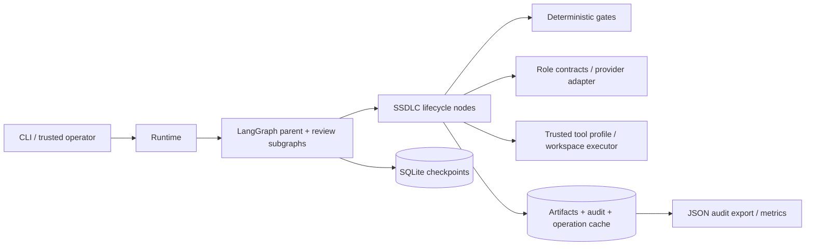

# Architecture

The domain is a versioned dependency graph of engineering artifacts. LangGraph
executes the lifecycle; Python policies decide whether transitions are legal.

The default development model integration is local Ollama. Environment configuration
selects the model, role overrides and optional audited fallback. Agents depend only
on the provider protocol. See [LLM provider architecture](llm-provider-architecture.md).

`models.py` defines Pydantic contracts. `state.py` defines JSON checkpoint state
with map reducers for disjoint parallel outputs. `engine.py` owns version creation,
lineage, provider validation and review reconciliation. `nodes.py` owns lifecycle
actions. `graph.py` owns framework wiring. `policy.py` contains gates and immutable
budget settings. `runtime.py` holds connections, run leases and operator APIs.

Artifacts have stable IDs and monotonically increasing versions, immutable content
digests, exact dependency references, validity and approval metadata. Active pointers
are distinct from version history. Findings have durable identities and dispositions;
absence from a later review never closes an earlier finding. Resolution requires a
new artifact version and explicit reviewer verification.

Architecture and embedded technology ADRs are approved together. Plans consume
those ADR versions. LLD depends on the plan and prerequisite slice acceptances.
Code and tests depend on the same LLD; test artifacts never depend on code.
Validation depends on exact materialized code/test/snapshot references; acceptance
depends on validation; release depends on build, documentation and release report.

Brownfield runs copy a bounded, secret-screened source snapshot into the run
workspace. The impact agent consumes it before planning. The original repository
is never modified by a workload. Later slice file bundles overlay earlier bundles
in topological plan order. Deletion/rename patches are intentionally not supported.

The prototype uses local SQLite and a per-run lease, not distributed orchestration
infrastructure. Multiple authors of the same run are rejected. Provider/network
timeouts are the responsibility of the injected client; tool timeouts are enforced
by the executor. External production deployment is outside this boundary.
