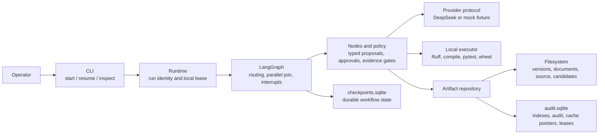

# Architecture

The implementation collects explicit human decisions, generates typed engineering proposals and enforces progress using saved state and actual evidence. LangGraph orchestrates these responsibilities; application code owns policy.

## Component ownership

| Component | Main source files under `src/ssdlc/` | Responsibility |
|---|---|---|
| CLI | `cli.py`, `config.py` | Load local configuration, show progress/gates, collect decisions and expose inspection/export. |
| Runtime | `runtime.py` | Bind run/provider identity, open stores, snapshot brownfield input, start/resume workflows and report metrics. |
| Graph | `graph.py`, `state.py` | Explicit conditional routes, parallel branch map merges and the join barrier. |
| Engineering and policy | `nodes.py`, `engine.py`, `agents.py`, `models.py`, `policy.py` | Typed role contracts, semantic validation, bounded calls/reviews, exact approvals, invalidation and release gates. |
| Providers | `providers.py`, `mock.py` | DeepSeek JSON-mode HTTP calls or the deterministic greeting fixture; no synthetic fallback. |
| Persistence | `persistence.py` | Immutable content files, Markdown/source companions, mutable metadata and a local audit hash chain. |
| Tools | `tools.py` | Confined candidate materialization and actual fixed Python commands with captured evidence. |
| Delivery packaging | `packaging.py`, `Runtime.package` | Export an approved release as a readable folder/ZIP, with named documents, source/tests, wheel, artifact references and evidence. No model calls or workflow changes. |

## Engineering artifacts

Requirements preserve original input and actual human answers as system-owned provenance. Architecture includes requirement mappings, alternatives and ADRs. An independent architecture reviewer assesses it before joint human approval of architecture/ADRs.

One Plan response contains ordered vertical slices with requirement references, acceptance IDs, risks and implementation design. Code and independent tests consume the same approved baseline and slice design concurrently. The test designer does not receive generated implementation files or code-author output. Shared Quality Review assesses the joined pair. Release Readiness combines engineering documentation, operations, limitations and measured evidence.

Pydantic validates shape. Stage validators enforce exact references, coverage, meaningful required sections, dependency order, paths, file ownership and criterion-to-test mappings. Responses enter the cache only after validation; cached responses are checked again. Strict schemas can still reject a model response after bounded repair attempts, so model availability does not guarantee success.

## Filesystem and database boundary

Canonical artifact content, dependencies and digests live in versioned JSON. Artifacts with `sections` also have Markdown companions; code/test bundles have raw-file companions. Requirements and plans remain JSON. Candidates assemble the brownfield snapshot and valid slice changes, including tests, JUnit reports and wheels.

`audit.sqlite` holds artifact indexes/mutable metadata, provider-cache file pointers, audit records and local leases. `checkpoints.sqlite` holds LangGraph state, which can include serialized artifact data. Artifact storage is filesystem-backed with database-managed state; this does not mean artifact data never appears in SQLite.

New versions retain old content and invalidate dependent evidence or mark it for revalidation. Targeted tool-failure recovery can reuse a valid reviewed sibling; the changed pair is reviewed again. Audit hashes support local integrity checks, not externally guaranteed tamper resistance. The stores support the local single-writer prototype.

## Evidence and release boundary

The executor uses the CLI's Python interpreter. Its child environment strips ordinary application credentials, disables pytest plugin autoload and disallows package-index access through pip. It records command, status, duration, output summary, artifact references and candidate fingerprint. These guards do not create an OS sandbox or prevent all network access; generated code/build hooks run on the host.

Release requires the approved current baseline, complete reviews without prohibited findings, accepted slices with passing actual tests, a successful actual build and a matching candidate. Earlier slice tests must pass in the final cumulative candidate too. Final approval rechecks the candidate and records readiness. No server-start or deployment tool is exposed.

See [orchestration](orchestration.md) for the lifecycle and recovery, and [enhancements](enhancements.md) for remaining work.
