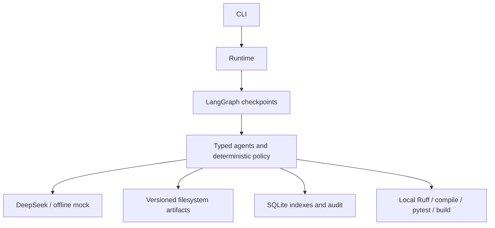

# Architecture

The CLI collects explicit decisions. Runtime opens SQLite checkpoints, the artifact repository, and a local tool executor. LangGraph owns durable execution, fan-out, the join barrier, and interrupt/resume. Nodes enforce domain rules; the generic Provider protocol separates these rules from DeepSeek's JSON-mode HTTP adapter and the deterministic mock fixture.

Requirements retain original input and human decisions as system-owned provenance. Architecture contains alternatives, requirement mapping, and ADRs. An independent reviewer assesses architecture before joint human approval. One Plan response carries dependency-ordered vertical slices, exact requirement/acceptance IDs, risks, and implementation design per slice. Code and independently designed tests consume the same approved baseline and slice design concurrently. A shared Quality Review evaluates the joined pair. Release Readiness produces one report containing documentation and measured evidence.

Schemas validate shape; stage validators enforce exact IDs, coverage, nonempty design/report sections, dependency order, safe paths, branch ownership, and traceability before successful responses enter the cache. Replayed cached output is validated again. Failed responses get at most two attempts with validation feedback; an invalid response cannot become a published artifact.

Artifact bodies and cached responses are versioned JSON files. SQLite stores file pointers, hashes, indexes, audit events and checkpoints. Replacing a version preserves history and marks dependent outputs invalid or requiring revalidation. Branch state merges maps only, avoiding parallel writes to scalar routing fields. Single-writer leases and the existing audit hash chain support local accountability without introducing a persistence framework. Export collects saved evidence; it does not infer success from model prose.

The fixed Python tool set executes actual commands and captures exit status, output, timing, candidate fingerprint, JUnit results and artifact references. Static checks mean Ruff plus bytecode compilation; no type checker or vulnerability scanner is claimed. A release requires reviewed current artifacts, passed acceptance tests including earlier slices, a successful actual build, unchanged candidate files, and final human approval. No deployment tool is exposed.
