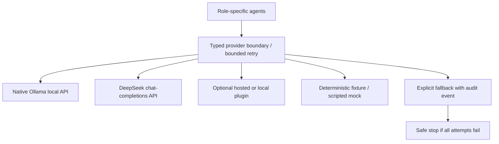

# LLM provider architecture

The platform is not vendor-locked. Model capability is replaceable infrastructure;
structured artifacts and deterministic policies remain authoritative.

`OllamaProvider` calls `/api/chat` with `stream=false` and JSON-schema `format`.
It enforces request/queue timeouts, response-size limits, configurable token budgets
and default concurrency of one to limit local memory pressure. Agents never import
a vendor SDK. All responses pass the same Pydantic validation boundary.

Environment configuration selects a primary and optional fallback. Each gets two
attempts by default. Schema failures receive sanitized field/type feedback for a
bounded repair attempt. Exhaustion emits `provider_fallback` before switching. If
no configured provider succeeds, SAFE_STOP waits for a human. Real runs cannot fall
back to synthetic mock answers. Model availability never changes approval policy.

`MockProvider` is an offline greeting fixture. `ScriptedMockProvider` accepts per-role
response/error sequences. Automated tests need no internet, API key or model server.
The optional `scripts/check_ollama.py` validates a real structured response without
executing generated code or approving any workflow.

Optional hosted inference uses `LLM_PROVIDER=plugin` and a trusted factory. The
included `StructuredChatProvider` adapts configured LangChain-compatible clients.
SDKs, credentials and client timeouts remain in that plugin. Hosted inference may
offer stronger quality but is not required. Hugging Face hosted inference would be
a network-backed plugin; locally executed Hugging Face weights would use a local
runtime plugin or Ollama import. Neither is a mandatory dependency.

`LLM_ROLE_MODELS` maps agent roles to installed model tags, allowing coding and
review models to differ without changing orchestration semantics. Provider identity
includes model configuration and must match on resume. Request timeout/concurrency
can change for recovery; model/context/output changes require a new run.

Local models support low-cost offline experimentation after download. Small models
may produce incomplete architecture, weak reviews or incorrect traceability. The
1.7B-class local setup is a connectivity/development starting point, not a claim of
reliable autonomous engineering. Larger instruction/coding models can be selected
as hardware permits. Review calls to the same model can have correlated errors.

`DeepSeekProvider` calls the OpenAI-compatible `/chat/completions` endpoint with
JSON-object mode and the requested Pydantic schema in its system prompt. Configure
`LLM_PROVIDER=deepseek`, `LLM_MODEL=deepseek-flash`, and a local
`DEEPSEEK_API_KEY` (or `LLM_API_KEY`) in `.env`. The key is sent only as a bearer
header and is excluded from provider identity and errors.

No key is needed for local Ollama. URLs reject embedded credentials. Errors never
persist remote response bodies; schema failures omit raw input. Environment secrets
are screened/redacted before prompts, cache, artifacts and structured logs. This
is best-effort protection, not comprehensive DLP. Never submit secrets as input.

Sources: [native chat API](https://docs.ollama.com/api/chat),
[Windows setup](https://docs.ollama.com/windows),
[Qwen3 1.7B tag](https://ollama.com/library/qwen3:1.7b).
