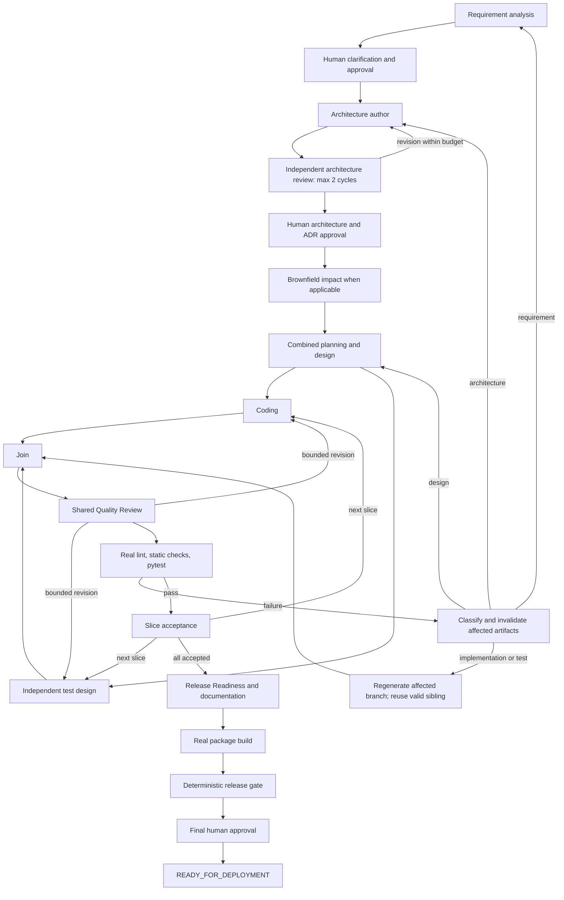

# Orchestration

Every policy failure can route to a persistent safe stop. Missing product decisions and unapproved scope changes pause rather than invent decisions. Architecture has two autonomous author/reviewer cycles; shared quality review is likewise bounded. BLOCKER findings prevent progress. HIGH findings require resolution or explicit human risk acceptance. Findings retain exact IDs across versions; omission is not resolution. Resolution needs a changed artifact, author response, actual change and reviewer verification.

There is no normal plan-approval gate, separate design call, per-branch reviewer graph, or standalone documentation call. Default failure-analysis replans are bounded at three. IMPLEMENTATION_DEFECT and TEST_DEFECT invalidate their corresponding branch and dependent review/tool evidence. DESIGN_DEFECT returns to combined planning/design. ARCHITECTURE_DEFECT and REQUIREMENT_DEFECT invalidate approvals downstream and re-enter the corresponding human governance. ENVIRONMENT_OR_TOOLING stops for configuration correction. Reviewer diagnosis does not itself count as a passing tool result.

Test generation receives authoritative requirement, architecture/ADRs and slice design. It does not receive generated implementation files or code-author output. Test files are owned by the test branch; production files by the coding branch. Both must finish before quality review and validation. Targeted tool-failure recovery preserves a valid reviewed sibling, then reviews the new pair again.

Brownfield starts with a bounded snapshot of the supplied source. Impact analysis references actual files and feeds the combined plan. The workflow writes into its run workspace and leaves the supplied repository unchanged. Rollback restores an approved historical pointer, retains audit history and invalidates descendants. Human retry, revise, risk disposition and abort are explicit checkpointed actions.
