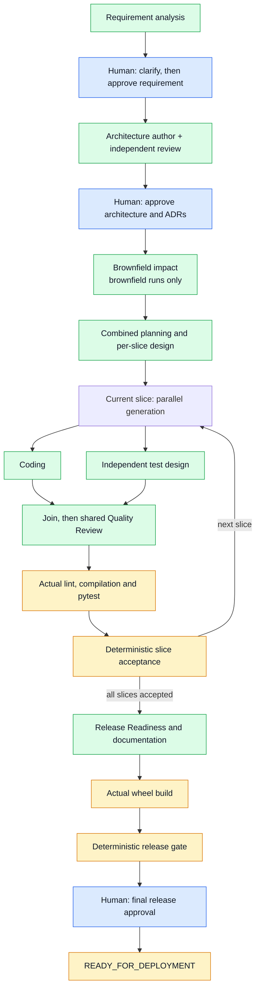

# Orchestration

The diagram groups related nodes to show the normal lifecycle. Blue marks human gates, green marks engineering proposals and yellow marks tool execution/evidence gates. Recovery is listed separately to keep the main flow readable.

Greenfield and ambiguous runs skip brownfield impact. Architecture revisions occur inside the grouped author/reviewer step. A rejected shared review sends both branches back for bounded revision. Tools run only after both branches finish and shared review passes. There is no separate design call, plan-approval gate, per-branch reviewer graph or documentation agent.

## Decisions and findings

Blocking questions must be clarified; clarification creates a new requirement version requiring separate approval. Architecture approval covers its ADRs. Approvals record actor, rationale and exact current reference; stale references are rejected. Final approval records readiness only.

BLOCKER and HIGH findings prevent normal progress. A human can explicitly accept eligible unresolved non-BLOCKER findings; BLOCKER risk cannot be accepted. Omission of an earlier finding does not resolve it. Resolution needs the same finding ID, a newer artifact, actual change, author response and reviewer verification. Interactive views hide settled findings from risk-acceptance choices while preserving history.

## Default bounds

| Limit | Default | Configuration |
|---|---|---|
| Schema/semantic response attempts | 2 per call | `Policy.max_provider_attempts` |
| Architecture review cycles | 2 | `Policy.max_review_cycles` |
| Shared quality review cycles | 2 per slice | `Policy.max_review_cycles` |
| Failure-analysis replans | 3 per run before explicit renewal | `Policy.max_replans` |
| Local command timeout | 60 seconds per command | `Policy.command_timeout` |
| DeepSeek HTTP timeout | 180 seconds per request | `LLM_TIMEOUT` |

Policy limits are constructor settings in the Python API; the CLI does not expose all of them. Human retry explicitly renews counters at a safe stop; it does not fix an underlying provider, artifact or environment problem.

## Failure and recovery

Actual validation/build failure triggers model-assisted classification. The orchestrator chooses a route and invalidates affected artifacts and descendants. Model diagnosis never counts as a passing tool result.

| Classification / event | Recovery |
|---|---|
| `IMPLEMENTATION_DEFECT` | Regenerate current code; reuse a valid reviewed test sibling, then review the changed pair. |
| `TEST_DEFECT` | Regenerate current tests; reuse valid reviewed code, then review the changed pair. |
| `DESIGN_DEFECT` | Invalidate Plan and descendants; return to combined planning/design. |
| `ARCHITECTURE_DEFECT` | Invalidate architecture and descendants; repeat author/review and human architecture/ADR approval. |
| `REQUIREMENT_DEFECT` | Invalidate requirement and descendants; reanalyze and obtain new approval. |
| `ENVIRONMENT_OR_TOOLING` | Safe stop; correct configuration/dependencies before retrying validation. |
| Schema/policy failure or exhausted budget | Persistent safe stop with reason and recovery stage. |
| Unapproved scope proposal or branch deviation | Stop rather than implement it; revise supported feedback or return to governance. |
| Candidate changed during final human review | Safe stop; stale evidence cannot authorize readiness. |

Safe-stop choices depend on evidence: retry, supported revision, rollback, eligible risk acceptance or abort. Rollback restores an approved historical pointer, retains audit history and invalidates descendants. It does not change the supplied brownfield source. Legacy safe stops naming former planning/design stages return to combined planning/design; checkpoints directly inside removed graph nodes require a new run.

## Brownfield scope

The source snapshot allows at most 100 selected files and 150,000 bytes. It includes `.py`, `.go`, `.java`, `.md`, `.toml`, `.json` and `.yaml`, excluding hidden directories and common build/dependency outputs. These extensions do not imply non-Python execution support. Over-budget snapshots are rejected, not silently truncated; provide a focused workspace.

Impact analysis runs after architecture approval and feeds combined planning/design. Candidates include the snapshot plus generated changes; the original source remains unchanged. A real analytics extension needs real previously generated URL-shortener source, not the mock greeting.
